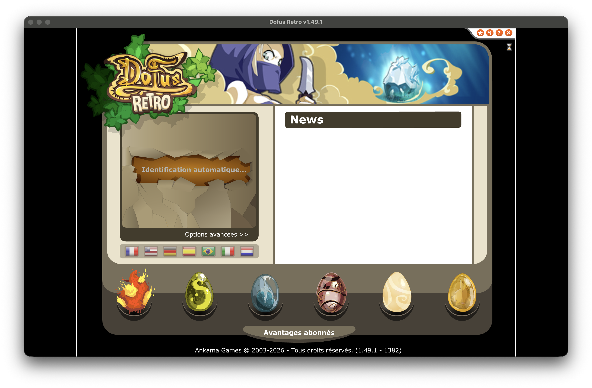

# Dofus Retro native

**DOFUS Retro sur macOS Apple Silicon, nativement, sans Rosetta.** Preuve de concept
remplaçant le plugin Flash x86 par [Ruffle](https://ruffle.rs) dans un shell Electron.
Fonctionne aussi sous Linux et Windows.



> **Périmètre du projet.** Ce dépôt ne contient, ne redistribue et ne modifie aucun
> fichier d'Ankama. Il exécute les SWF d'une **installation officielle** avec un autre
> moteur (Ruffle, natif arm64) à la place du plugin Flash abandonné. La couche
> d'authentification (Zaap) et la couche de sécurité du client n'ont pas été analysées,
> contournées ni réimplémentées : **le client s'arrête à l'écran de connexion.**
> Projet non affilié à Ankama.

## Pourquoi

Le client Retro est une application Electron qui charge `preloader.swf` puis `loader.swf`
via **PepperFlash**, un plugin Intel qu'Adobe ne maintient plus. Sur Apple Silicon, toute
la chaîne tourne donc sous Rosetta.

Apple a annoncé que Rosetta resterait disponible jusqu'à macOS 27, puis serait limitée à
certaines anciennes applications ([source](https://support.apple.com/fr-fr/102527)). À
cette échéance, le client ne se lancera plus en l'état sur un Mac à jour.

Ruffle est une réimplémentation de Flash écrite en Rust, activement maintenue, compilée
en natif pour toutes les architectures et disponible en WebAssembly. Il exécute l'AVM1
(ActionScript 1/2) sur lequel repose Retro.

## État actuel

| | |
|---|---|
| Chargement `preloader.swf` → `loader.swf` | ✅ |
| Rendu, polices, assets, bannières CDN | ✅ |
| Pont `ExternalInterface` (JS ↔ SWF) | ✅ |
| Écran de connexion complet | ✅ |
| Connexion à un compte | ❌ (hors périmètre) |

Le pont fonctionne dans les deux sens sans modifier le code d'Ankama : le SWF appelle
`changeTitle`, et la fenêtre se renomme en « Dofus Retro v1.49.1 ».

## Comment ça marche

```
serveur HTTP local  ─────►  Electron (arm64 natif)
(dossier du jeu)            ├─ index.html : Ruffle (WASM) ──► preloader.swf
                            │               stubs ExternalInterface
                            └─ main.js    : pont WebSocket → TCP
```

Trois briques :

1. **Un serveur HTTP local** sert le dossier du client. Ruffle web ne sait pas charger
   d'URL `file://`, et un SWF ouvert depuis le disque tombe dans le sandbox Flash
   « local », qui interdit l'accès réseau (d'où le message *« configurez DOFUS comme
   application de confiance »*). Servi en HTTP, le SWF passe en sandbox « remote » et les
   chemins relatifs (`loader.swf`, `clips/`, `data/`) se résolvent correctement.
2. **Un pont WebSocket → TCP** dans `main.js`. Ruffle web ne peut pas ouvrir de socket TCP
   brut : les `XMLSocket` du jeu sont redirigées (option `socketProxy`) vers
   `ws://localhost:8765/<host>/<port>`, que le process principal réouvre en vrai TCP.
3. **Des stubs `ExternalInterface`** dans `index.html`. Le SWF appelle des fonctions
   JavaScript fournies normalement par le client officiel (`getElectronVersion`,
   `changeTitle`, `zaapConnect`, `consoleLog`…). Elles sont exposées ici, journalisées,
   avec des retours neutres. Celles liées à l'authentification et à la sécurité sont
   volontairement vides.

## Prérequis

- DOFUS Retro installé via l'**Ankama Launcher** (le dépôt ne fournit aucun fichier de jeu)
- Node.js 18+
- Python 3 (pour le serveur statique)

## Installation

```bash
git clone https://github.com/RawZ06/Dofus-retro-native
cd Dofus-retro-native
npm install
```

## Lancement

**1. Servir le dossier du client** (dans un premier terminal) :

```bash
cd "/Applications/Ankama/Retro/Dofus Retro.app/Contents/Resources/app/retroclient"
python3 -m http.server 8000
```

Le dossier doit contenir `preloader.swf`, `loader.swf` et `config.xml`. Il est lu en
lecture seule, jamais modifié.

**2. Lancer le client** (dans un second terminal) :

```bash
cd Dofus-retro-native
npm start
```

L'écran de connexion de DOFUS Retro doit apparaître. La console de développement liste
les appels `ExternalInterface` sous la forme `[EI] nomFonction(args) -> retour`.

## Dépannage

**« Can't find loader.swf on your game directory »** — le serveur ne sert pas le bon
dossier, ou l'URL de base n'est pas résolue. Vérifiez les `404` dans le terminal du
serveur HTTP.

**« Vous devez configurer DOFUS comme application de confiance »** — le SWF est chargé en
`file://` au lieu de `http://`. C'est précisément ce que le serveur statique évite.

**« Impossible de lire le fichier de configuration »** — `config.xml` n'est pas accessible
via le serveur, ou `getUserDataTextFileContent` renvoie `|null|`.

**Electron ne démarre pas (`Library not loaded: Electron Framework`)** — extraction
incomplète du binaire. Réinstallez-le avec `ditto` plutôt qu'`unzip`, qui casse les liens
symboliques des frameworks macOS.

## Pour l'équipe Ankama

La migration ne demande pas de réécrire le client : il s'agit de remplacer le plugin
PepperFlash (et `flash-player-loader`, plus maintenu depuis ~10 ans) par la dépendance
[`@ruffle-rs/ruffle`](https://www.npmjs.com/package/@ruffle-rs/ruffle) dans le renderer.
`D1ElectronLauncher.js` continue de fonctionner tel quel, le pont `ExternalInterface`
étant supporté.

Il resterait à brancher l'API existante (Zaap, security) sur ce pont, et à router les
`XMLSocket` — soit via un proxy WebSocket comme ici, soit en utilisant `ruffle-desktop`
qui gère le TCP nativement.

## Licence

MIT. Ruffle est distribué sous licence MIT/Apache-2.0. DOFUS et DOFUS Retro sont des
marques d'Ankama ; ce projet n'est ni affilié à Ankama, ni approuvé par Ankama.
